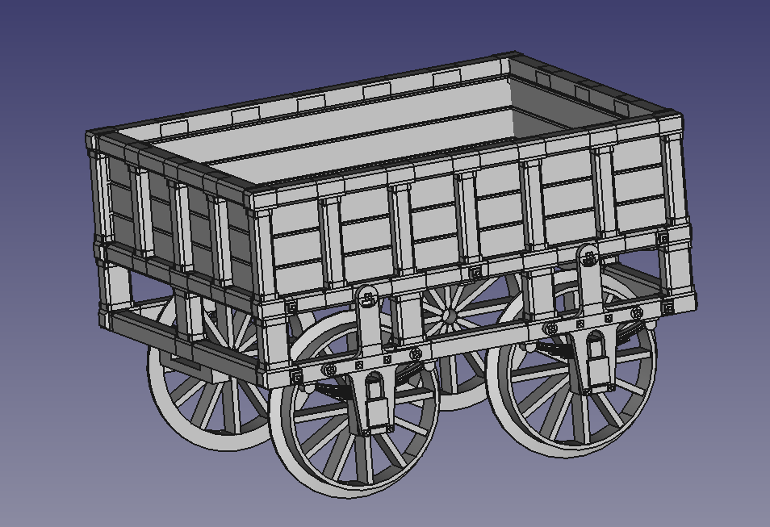
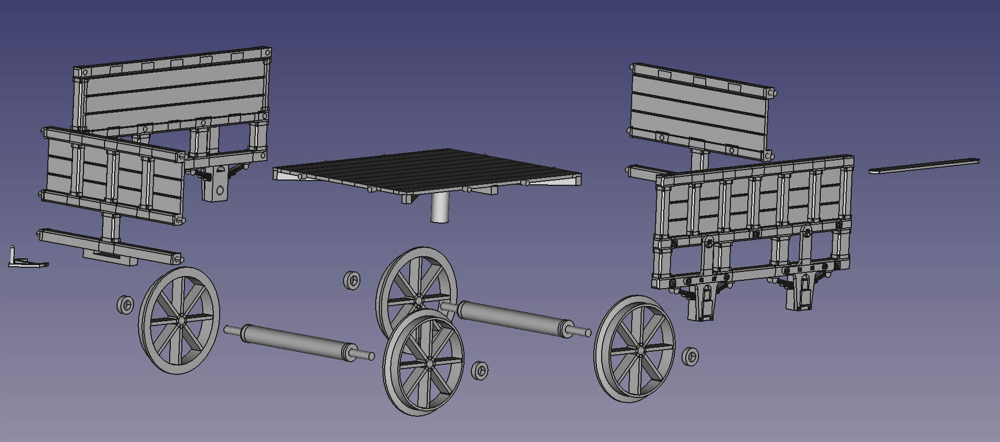

# Rocket-wagon

# Rocket-wagon
This respository contains the STL files to 3D print and construct a 1:16 scale, 3.5" gauge railway wagon.  The wagon is based on the Hornby 3.5" gauge Stephenson's Rocket model tender, without the water barrel or coal load, and including an enclosed front side.

# Parts included

The following parts are included in the STL files directory:
<UL>
<LI>Rocket wagon floor (1 required)
<LI>Rocket wagon short side (2 required)
<LI>Rocket wagon long side (2 required)
<LI>Rocket wagon axle (2 required)
<LI>Rocket wagon axle washer (4 required)
<LI>Rocket wagon wheel (4 required)
<LI>Rocket wagon draw pin (1 required)
<LI>Rocket wagon draw pin (1 required)
</UL>
NB: You will require one self-tapping screw to secure the draw bar under the floor of the wagon, and glue to secure the pieces together (not supplied).
  
Here is an exploded view of the parts:
  

# Construction

1. Print all required parts

2. Join one short side to the short edge of the floor (glue as needed). NB: The walls of the sides, and the gooves on the floor should both be uppermost.

3. Join the second short side to the other short edge of the floor (glue as needed)

4. Join one long side to the joined pieces above (glue as needed)

5. Place the assembled pieces down with the long side facing down (ready to receive the axles)

5. Assemble the axles and wheels (note washers are included that should go on narrow axle on the outside of the wheel) you will need two sets of axles with wheels

6. Place an assembled axles with wheels and washers with the short axle fitting into hole in the axle box on the long side of the pre-assembled pieces above.  DO NOT GLUE - these need to move freely (if being used as a running model)

7. Repeat with the second axle.

8. Now attach the second long side to the pre-assembled pieces, ensuring that the axles slot into the axle boxes and remain free-wheeling (the tabs that fit into the walls and floor maybe glued as needed)

9. Slide the draw pin piece in the slot under the floor level on one of the short sides by gently inserting the two retaining clips, ensuring they don't break off.  NB: The 'pin' should be pointing upward.

10. Attach the draw bar to the other end of the wagon.  Slide the long thin end into the slot under the floor level on the short side opposite the one you just inserted the draw clip into.  Draw in under the floow carefully until the scren hole on the draw bar lines up with the post in the middle under the floor.  Secure with an approprate self-tapping screw.  Ensure the screw remains loose enough for the draw bar to swing side to side. Do not use any glue in this area.

11. Your wagon should now be complete, paint and decorate to your liking.

12. Well done!

## License

This project is licensed under the MIT License - see the LICENSE file for details.

## Author

Justin Dunlop (Zero1Guy)
